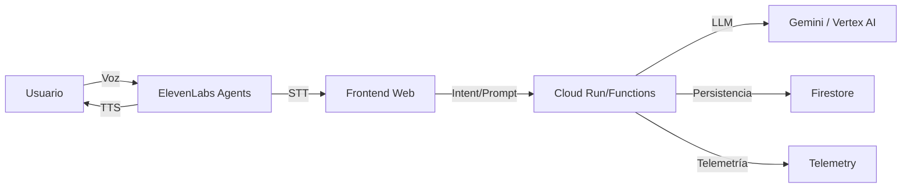
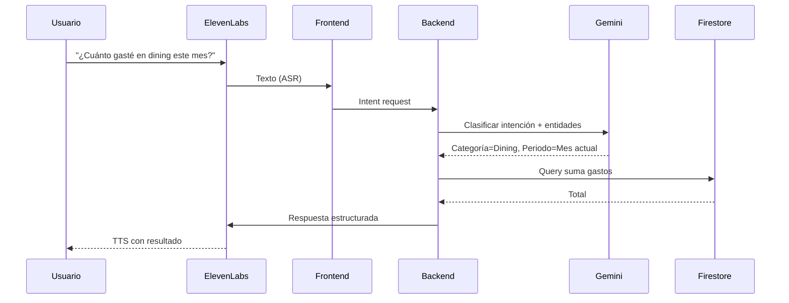
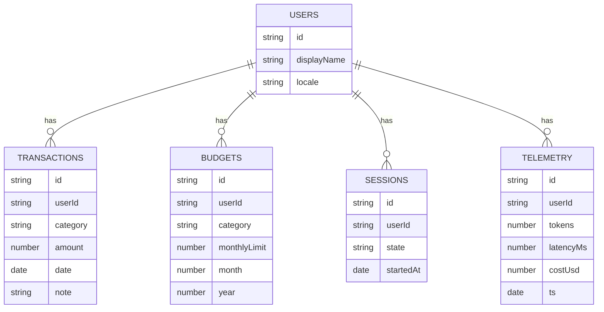
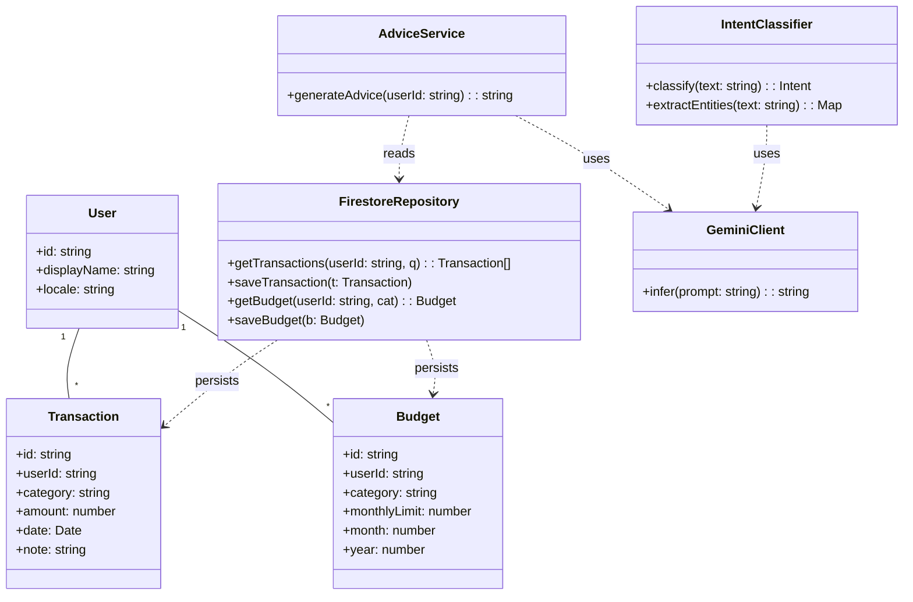
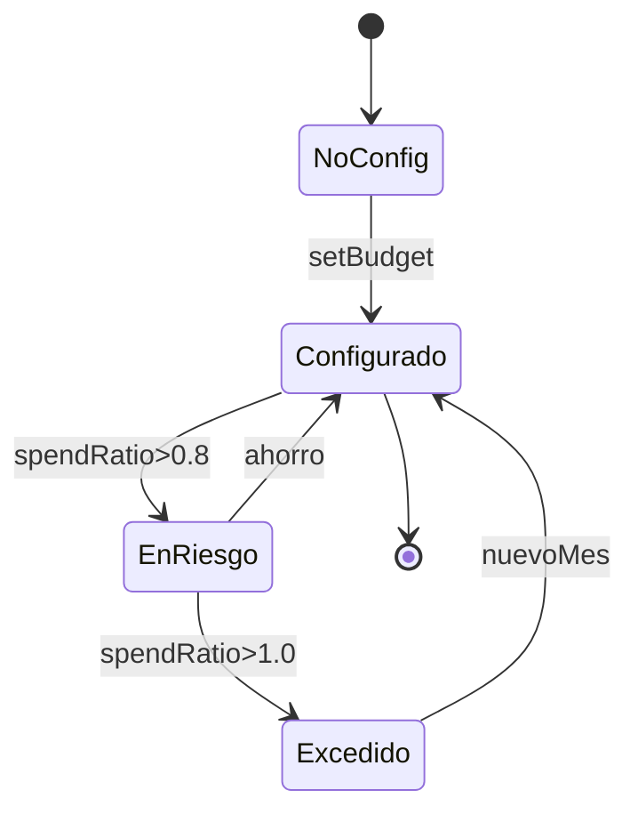

MASTERDOC: Conversational Financial Assistant (CFA)

1. Alcance y Objetivo
- App de asistencia financiera conversacional para el reto ElevenLabs del AI Partner Catalyst.
- Capacidades: consultas de gastos, presupuestos por voz, registro de transacciones y consejos personalizados.

2. Historias de Usuario
- HU.1: Consultar gasto por categoría/periodo.
- HU.2: Definir presupuesto mensual por voz.
- HU.3: Recibir consejos de ahorro basados en hábitos.
- HU.4: Registrar transacción hablada.
- HU.5: Voz amigable y profesional.

3. Requisitos Funcionales (FR)
- FR.1: Consulta de gastos (ASR ElevenLabs → intención Gemini → agregación en Firestore).
- FR.2: Análisis de presupuesto y proyección (Gemini + reglas).
- FR.3: Consejos personalizados (LLM con datos del usuario).
- FR.4: Registro de transacciones (extracción de entidades → persistencia Firestore).
- FR.5: Sesiones conversacionales con contexto y memoria corta.

4. Requisitos No Funcionales (RNF)
- RNF.1: Seguridad de claves con `Secret Manager`/variables seguras.
- RNF.2: Latencia aceptable para conversación (< 600 ms ASR/TTS, < 2 s inferencia LLM).
- RNF.3: Observabilidad: logs, métricas, trazas, telemetría de costos/tokens.
- RNF.4: Escalabilidad con `Cloud Run` y cuotas controladas.
- RNF.5: Accesibilidad y multilingüe.

5. Arquitectura (Mermaid)

6. Diagrama de Secuencia (Consulta de gasto)

7. Modelo de Datos (Firestore)

8. Endpoints (esbozo)
- `POST /api/intent`: texto/voz procesado → intención/entidades.
- `GET /api/spend?category&from&to`: suma por rango.
- `POST /api/budget`: crear/actualizar presupuesto.
- `POST /api/transaction`: registrar transacción.
- `GET /api/advice`: consejo personalizado.

9. Lógica de IA
- NLU con `Gemini`: clasificación de intención (consulta, presupuesto, registro, consejo).
- Extracción de entidades: categoría, cantidad, periodo, comercio.
- Generación: explicación y recomendaciones con contexto del usuario.
- Moderación: filtros de contenido y PII.

10. Seguridad
- Claves en `Secret Manager` o `.env` local no versionado.
- Autenticación simple por sesión y futura ampliación a OAuth.
- Sanitización de entradas y auditoría de acceso.

11. Observabilidad
- Logs estructurados (correlación por sesión).
- Métricas: latencia, tokens, costo, errores.
- Opcional: export a Datadog para reglas/alertas.

12. Pruebas
- Unitarias del parsing y reglas de negocio.
- Integración de endpoints.
- E2E conversacional con datos de ejemplo.

13. Despliegue
- `Cloud Run`: contenedor con autoscaling.
- `Firestore`: colecciones como arriba.
- Variables de entorno seguras.

14. Riesgos y Mitigaciones
- Latencia TTS/LLM: caching y prompts concisos.
- Costos: límites de tokens y monitoreo.
- Datos sensibles: anonimización y mínimos necesarios.

15. Roadmap
- M0: Intent + gasto por categoría.
- M1: Presupuesto y proyección.
- M2: Consejos personalizados y memoria de sesión.
- M3: Panel de telemetría y mejora UX.

16. UML de Clases (Dominio y Servicios)

17. Diagrama de Estados (Presupuesto mensual)

18. Historias de Usuario Extendidas
- HU.6: Importar datos de transacciones desde CSV/Excel o API bancaria (mock).
- HU.7: Crear metas de ahorro y seguimiento por voz (p.ej., viajar, emergencia).
- HU.8: Recibir alertas proactivas cuando el gasto se acerque al límite.
- HU.9: Detección de anomalías en gastos (posible fraude o duplicados).
- HU.10: Soporte multimoneda y conversión automática.
- HU.11: Ver desglose por comerciantes y tendencias semanales/mensuales.
- HU.12: Programar recordatorios de pagos (servicios, suscripciones) por voz.
- HU.13: Exportar reportes en CSV y PDF.
- HU.14: Personalizar la voz y personalidad del asistente (tono, idioma).
- HU.15: Modo manos libres con activación por palabra clave.
- HU.16: Historial de conversación y transcripción.
- HU.17: Panel de privacidad (opt-in/out para telemetría y datos analíticos).
- HU.18: Integración de categorías personalizadas y auto-clasificación de transacciones.
- HU.19: Consejos de optimización de presupuesto basados en patrones.
- HU.20: Sugerencias de ahorro semanal con objetivos realistas (habit formation).

19. Requisitos Funcionales Ampliados
- FR.6: Import de datos (archivo/local o API mock) y normalización.
- FR.7: Gestión de metas con progreso y proyección.
- FR.8: Alertas por umbral configurable y notificaciones locales.
- FR.9: Anomalías usando heurísticas (umbral, outliers) y validación manual.
- FR.10: Conversión de moneda con fuente configurable (mock) y almacenamiento.
- FR.11: Tendencias con agregaciones: semanal, mensual, por comercio.
- FR.12: Recordatorios de pago con programación y snooze.
- FR.13: Export en CSV/PDF de reportes, con filtros y rangos.
- FR.14: Personalización de voz ElevenLabs y perfiles por usuario.
- FR.15: Wake-word y sesión manos libres con límites de tiempo.
- FR.16: Transcripción persistente y búsqueda en historial.
- FR.17: Controles de privacidad y consentimiento (config por usuario).
- FR.18: Auto-clasificación con modelos simples + feedback para mejora.
- FR.19: Consejos gamificados y planes semanales de ahorro.

20. KPIs de Producto
- Adopción: usuarios activos/día y semana.
- Enganche: sesiones conversacionales por usuario, duración media.
- Exactitud: tasa de correcta clasificación de intención/entidades.
- Finanzas: ratio de cumplimiento de presupuesto y ahorro proyectado.
- Rendimiento: latencia ASR/TTS/LLM, error rates.
- Costos: tokens y costo por sesión.
- Privacidad: porcentaje de usuarios con telemetría opt-in.

21. Roadmap Detallado
- M0: Núcleo conversacional + consultas de gasto + backend/DB.
- M1: Presupuestos, proyección y consejos básicos.
- M2: Import/export y tendencias; transcripciones.
- M3: Alertas, anomalías y privacidad; personalización de voz.
- M4: Metas y gamificación; wake-word manos libres.
