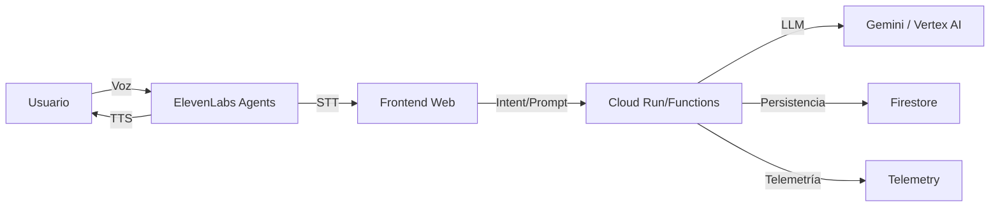

💬 Conversational Financial Assistant (CFA)

  
   
  <i>Your Financial Advisor, always a voice command away.</i>

  
  
  
  
  
  
  

**Quick Links**
- Hackathon: `https://ai-partner-catalyst.devpost.com/`
- Resources: `https://ai-partner-catalyst.devpost.com/resources`
- Vertex AI: `https://cloud.google.com/vertex-ai`
- Gemini API: `https://ai.google.dev/gemini-api`
- ElevenLabs Agents: `https://elevenlabs.io`

**Overview**
- CFA is a voice-first financial coach for the ElevenLabs challenge in the AI Partner Catalyst hackathon (Google Cloud).
- It combines `Gemini` for financial reasoning and `ElevenLabs Agents` for natural voice (STT/TTS) and assistant persona.
- Goal: enable spend queries, budgeting, transaction logging, risk insights and proactive advice via voice.

**Selected Challenge**
- ElevenLabs: build a conversational, intelligent, voice-based app using `ElevenLabs Agents` with `Vertex AI`/`Gemini`.

**Features**
- Query spend by category/period.
- Voice-driven budgets with tracking and monthly projection.
- Spoken transaction logging with entity/amount extraction.
- Personalized financial advice generated by `Gemini`.
- Natural multilingual voice via `ElevenLabs`.

**Pro Features**
- Data import (CSV/Excel/API mock) with auto-classification.
- Spend threshold alerts and anomaly detection.
- Merchant/weekly/monthly trends and multi-currency.
- Reports export (CSV/PDF) and session transcription.
- Assistant voice/persona customization and wake‑word.
- Privacy panel with consent and telemetry controls.

**Architecture**
- Frontend: Web client with `ElevenLabs` (SDK/Agents) for audio capture/playback.
- Backend: `Cloud Run`/`Functions` service orchestrating `Gemini` and persisting into `Firestore`.
- Data: collections `users`, `transactions`, `budgets`, `sessions`, `telemetry`.
- Observability/Security: structured logging, tracing, key management via `Secret Manager`.

**Technology Stack**
- AI: `Gemini` (NLP, intent classification, advice generation), `Vertex AI`.
- Voice: `ElevenLabs Agents` (ASR/TTS, assistant persona).
- Backend: `Cloud Run`/`Functions` with Node/TypeScript or Python.
- DB: `Firestore` (NoSQL) for transactions, budgets and sessions.

**Getting Started**
- Requirements: Google Cloud account, `Gemini`/`Vertex AI` keys, `ElevenLabs` account.
- Setup:
  - Create a GCP project and enable `Vertex AI`.
  - Configure keys in `Secret Manager` or local environment variables.
  - Install dependencies and start servers.

**Local Development**
- Backend:
  - `cd backend`
  - `npm install`
  - `npm run dev` → `http://localhost:3001/` (`/health`, `/api/*`)
- Frontend:
  - `cd frontend`
  - `npm install`
  - `npm run dev` → `http://localhost:5173/`
- Notes:
  - API routes are stubbed to validate end-to-end flow.
  - Keys/config added via `Secret Manager`/`.env` before real integrations.

**Environment**
- Configure variables in `.env` (or use `Secret Manager`):
  - `PORT=3001`
  - `GEMINI_API_KEY=<value>`
  - `ELEVENLABS_API_KEY=<value>`
  - `ELEVENLABS_VOICE_ID=<value>`
  - `ELEVENLABS_MODEL_ID=eleven_multilingual_v2`
- Reference: `./.env.example`

**Hackathon Compliance**
- Public repo with visible OSI license.
- Demo video ≤ 3 min.
- Deployed project URL accessible to judges.
- Selected challenge: ElevenLabs.
- English-compatible UI and documentation.

**Roadmap**
- M0: Conversación básica y consultas de gasto.
- M1: Presupuestos y proyección con consejos.
- M2: Import/export, tendencias y transcripciones.
- M3: Alertas/anomalías, privacidad y voz personalizada.
- M4: Metas, gamificación y wake‑word manos libres.

**Documentation**
- Full specification in `MASTERDOC.md` (architecture, UML, DB, flows, tests, security).

**User Stories (20)**
- US.1: Query spend by category/period.
- US.2: Set monthly budget via voice.
- US.3: Habit-based savings advice.
- US.4: Voice transaction logging.
- US.5: Friendly, professional assistant voice.
- US.6: Import transactions (CSV/Excel/API mock).
- US.7: Savings goals and voice tracking.
- US.8: Proactive alerts near budget limits.
- US.9: Anomaly detection in spending.
- US.10: Multi-currency and conversion.
- US.11: Merchant breakdown and trends.
- US.12: Voice payment reminders.
- US.13: CSV/PDF report export.
- US.14: Customize assistant voice/persona.
- US.15: Hands-free mode with wake‑word.
- US.16: Conversation history and transcription.
- US.17: Privacy panel (opt‑in/out telemetry).
- US.18: Custom categories and auto‑classification.
- US.19: Budget optimization from patterns.
- US.20: Weekly savings suggestions (habit formation).

**System Diagram (Summary)**

**Project Links**
- Masterdoc: `./MASTERDOC.md`
- License: `./LICENSE`
- Hackathon (Devpost): `https://ai-partner-catalyst.devpost.com/`

**License**
- MIT. Ver sección `License` y archivo `LICENSE`.

**Acknowledgements**
- Google Cloud, ElevenLabs, Devpost community.
